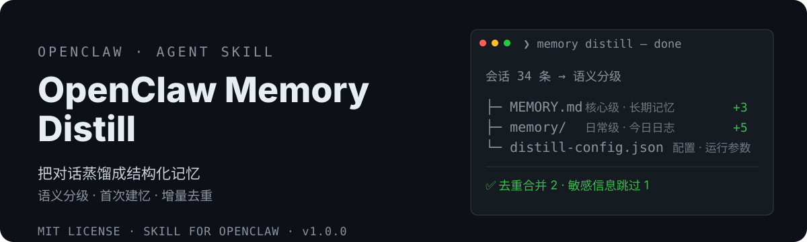

# OpenClaw Memory Distill 🧠

<div align="center">
  <strong>🇨🇳 中文</strong> | <a href="README.en.md">🌐 English</a>
</div>

<p align="center">
  
</p>

> 把对话蒸馏成结构化记忆，解决会话上下文溢出。
> OpenClaw memory distillation & organization — distill conversations into MEMORY.md + daily logs, so your agent never forgets.


## 为什么需要它

OpenClaw agent 每次会话都是全新启动。没有记忆整理，你的 agent 会：
- ❌ **上下文溢出**：对话一长，重要信息被挤掉，只能 /reset 失忆重来
- ❌ **记忆碎片化**：决策、项目状态散落在各天日志里，永远找不到
- ❌ **MEMORY.md 缺失**：没有长期记忆文件，每次醒来都像第一次见面
- ❌ **重复膨胀**：反复写入同样内容，记忆文件越堆越臃肿

这个 skill 一次性解决：**蒸馏分级 + 首次建忆 + 增量去重 + 敏感信息防护**。

## 特性

- 🧪 **语义分级**：核心级 → 根目录 MEMORY.md；日常级 → memory/YYYY-MM-DD.md；临时级 → 只留当日（靠语义理解，不靠关键词匹配）
- 🏗️ **首次建忆**：MEMORY.md 缺失时，扫描历史日志自动提炼生成初版——不用从空骨架开始
- 🔁 **增量去重**：写入前查重，只追加新条目、合并重复项，防记忆膨胀
- 🔒 **敏感信息跳过**：token/密码/密钥自动检测，默认不落盘
- 🗄️ **只归档不删除**：过期日志移动到 archive/，删除必须人工确认
- 🕐 **三种触发**：手动一句话 / Cron 每日定时 / HEARTBEAT 动态触发
- 🧍 **多 agent 隔离**：每个 agent 只整理自己的工作区记忆，互不干扰
- 🏠 **与 initializer 互补**：它管记忆系统的「家」，本技能管记忆系统的「内容」

## 安装

```bash
# ClawHub（推荐）
clawhub install xiaoyaoclaw-memory-distill

# 或从 GitHub 手动安装
git clone https://github.com/dtsola/xiaoyaoclaw-memory-distill
# 把 SKILL.md 和 templates/ 放到你的 skills 目录
```

## 使用

1. 把 skill 放到 OpenClaw 的 skills 目录
2. 对 agent 说「**蒸馏记忆**」，agent 会自动：
   - 检测 memory/ 与 MEMORY.md（缺失则从历史日志**首次建忆**）
   - 扫描会话 → 语义分级 → 出蒸馏报告（含敏感信息提示）
   - 增量去重写入 → 汇报结果
3. 可选：说「配置每天 22:00 自动执行记忆蒸馏」开启定时蒸馏

## 🚀 快速上手（三步，5 分钟）

### Step 1：安装技能

```bash
clawhub install xiaoyaoclaw-memory-distill
```

### Step 2：一句话触发首次蒸馏

对你的 agent 说：

> 蒸馏记忆

agent 自动完成：检测记忆状态 → （MEMORY.md 缺失则扫描历史日志首次建忆）→ 扫描本次会话 → 语义分级 → 出报告 → 确认写入 → 汇报结果。

### Step 3：验收 + 开启自动蒸馏

打开工作区目录验收：

```
工作区根目录/
├── MEMORY.md               ← 长期记忆（核心级）已就位
├── distill-config.json     ← 蒸馏配置
└── memory/
    └── YYYY-MM-DD.md       ← 今日蒸馏日志
```

想要每天自动蒸馏，对 agent 说：

> 配置每天 22:00 自动执行记忆蒸馏

上下文快满时：先「蒸馏记忆」再 `/reset`，记忆不丢。

### 日常使用习惯

| 场景 | 动作 |
|---|---|
| 会话结束 / 上下文快满 | 手动说「蒸馏记忆」，再 /reset |
| 长期使用 | 配置 cron 每日 22:00 自动蒸馏 |
| 每周沉淀 | 说「提炼记忆」→ 近 7 天日志精华合并进 MEMORY.md |
| 敏感对话 | 蒸馏报告自动跳过敏感信息，无需手动处理 |

## 与其他方案的区别

| | systiger/memory-distill | **xiaoyaoclaw-memory-distill** |
|---|---|---|
| 信息分类 | 关键词匹配 | ✅ 语义分级（核心/日常/临时） |
| MEMORY.md 缺失 | 只建空骨架 | ✅ 首次建忆：从历史日志提炼生成 |
| 重复写入 | 无防护，会膨胀 | ✅ 增量查重合并 |
| 敏感信息 | 一句话提示 | ✅ 自动检测默认跳过 |
| 过期清理 | 自动删除（retentionDays） | ✅ 只归档不删除，删除需确认 |
| 自动 /reset | 配置项存在 | ✅ 不提供该配置（重置由用户自行决定） |
| 多 agent 记忆 | 不区分 | ✅ 每个 agent 独立处理自己的 |
| 与工作区规范 | 无关联 | ✅ 路径按 WORKSPACE.md，配置安全继承 initializer 铁律 |

## 目录结构

```
xiaoyaoclaw-memory-distill/
├── SKILL.md                    # 技能主体（工作流 Step 1-7）
├── templates/
│   ├── distill-config.json     # 蒸馏配置模板
│   ├── MEMORY.md               # 长期记忆结构模板（首次建忆底子）
│   └── AGENTS-memory-safety.md # 记忆安全规范（追加到 AGENTS.md）
├── docs/
│   └── DESIGN.md               # 设计方案
├── README.md
└── LICENSE
```

## License

MIT — 随便用，署名可选。

---

## 🛠️ 需要定制？

**Agent & Skills 定制，价格 ¥800 起。**

- 微信：`dtsola`（添加好友时备注：**openclaw定制**）
- 服务范围：OpenClaw 多 agent 部署 / 工作区规范化 / 自定义 Skill 开发 / agent 记忆系统搭建

## 姊妹项目

- 🏠 **xiaoyaoclaw-workspace-initializer**（工作区初始化器）：给每个 agent 一个「家」——标准目录结构 + WORKSPACE.md 规范 + 多 agent 配置安全。<https://github.com/dtsola/xiaoyaoclaw-workspace-initializer>

## 小遥Claw

**小遥Claw，把 AI 助手装进自己的电脑。**

- 🚀 宣传页：<https://www.yuque.com/dtsola/igp1aa/adcicbai2zlem0bz>
- 📖 介绍页：<https://github.com/dtsola/xiaoyaoclaw-introduction>

## 关于作者

- 🌐 博客：<https://www.dtsola.com>
- 📺 B站：<https://space.bilibili.com/736015>
- 💻 GitHub：<https://github.com/dtsola>
- 📕 小红书：<https://www.xiaohongshu.com/user/profile/5b4c0597e8ac2b06aa13346d>

## 💬 加入交流群

小遥全系产品用户交流群——产品反馈 · 使用交流 · 功能建议：

<p align="center">
  
</p>

<p align="center">扫码加群，或添加微信 <code>dtsola</code>（备注：<b>加群</b>）</p>
